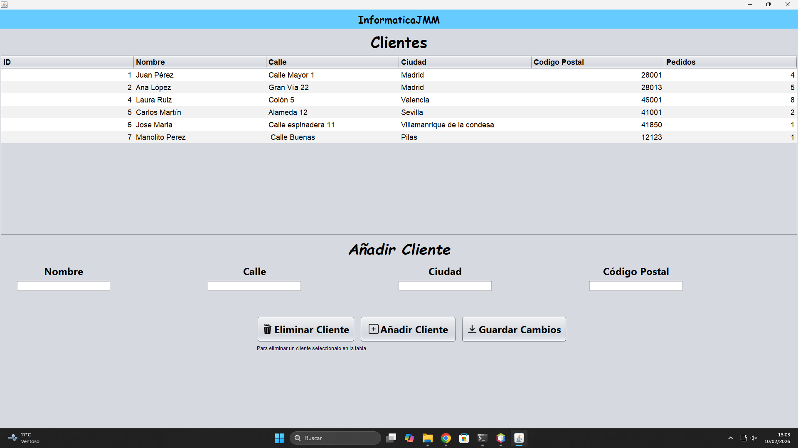
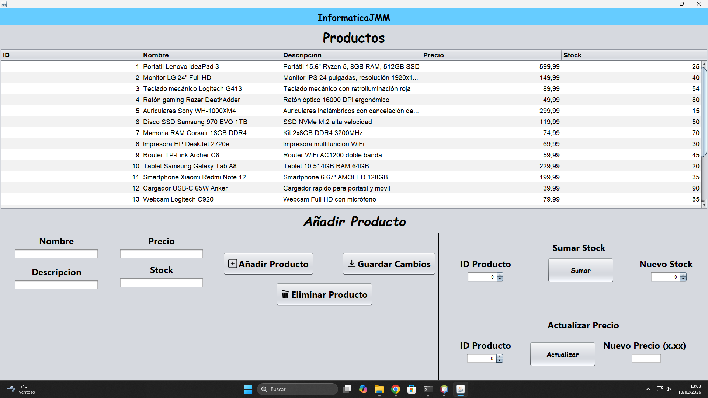
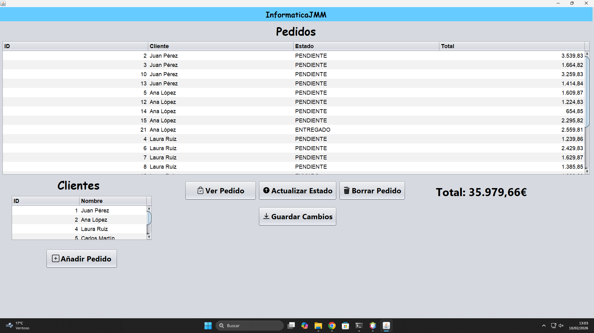
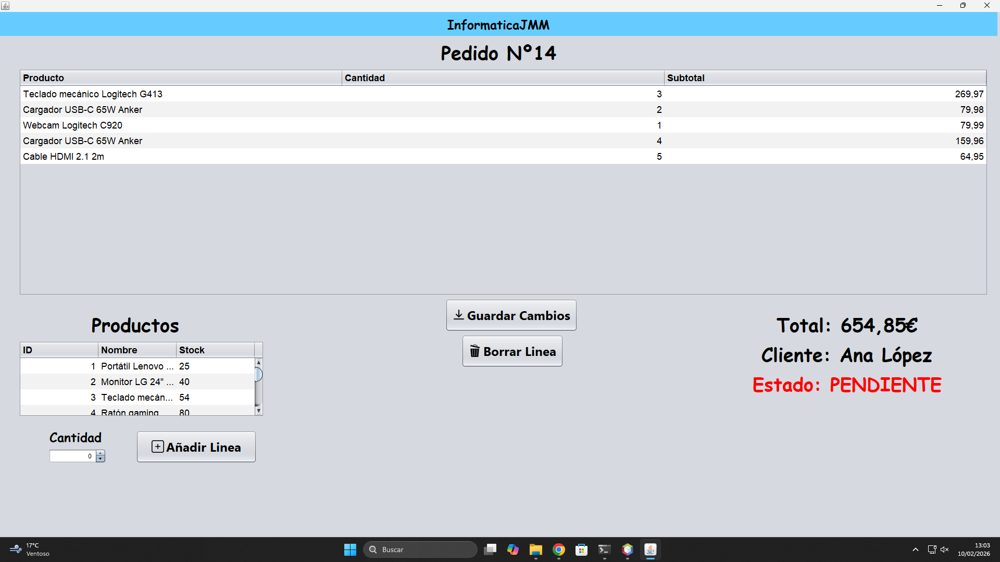

# 🛒 Sistema de Gestión de Tienda (Java Swing)

Aplicación de escritorio desarrollada en **Java** utilizando **Swing**, que simula un sistema básico de gestión de tienda con clientes, productos y pedidos.  
El proyecto está enfocado en aplicar **Programación Orientada a Objetos**, manejo de colecciones, serialización y arquitectura MVC básica.

---

## 🚀 Características principales

- Gestión de **clientes**
- Gestión de **productos**
- Creación y administración de **pedidos**
- Control automático de **stock**
- Estados de pedido (`PENDIENTE`, `ENVIADO`, `ENTREGADO`)
- Persistencia de datos mediante **serialización**
- Tablas dinámicas con ordenación y actualización en tiempo real
- Interfaz gráfica completa desarrollada con **Java Swing**

---

## 🧠 Conceptos aplicados

- Programación Orientada a Objetos (OOP)
- Encapsulación y diseño de entidades
- Colecciones (`ArrayList`)
- Enumeraciones (`enum`)
- Manejo de eventos Swing
- Arquitectura basada en modelo–vista
- Formateo de datos y renderizado personalizado en tablas
- Persistencia de objetos en fichero

---

## 🛠 Tecnologías utilizadas

- Java
- Swing (GUI)
- NetBeans IDE
- Serialización Java

---
## 📷 Capturas

